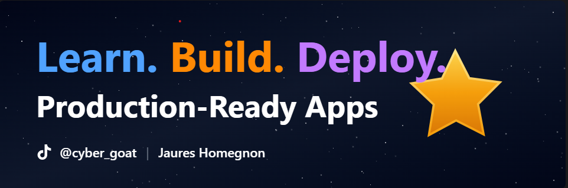

# Salut, moi c'est Jaures 👋

Étudiant en Systèmes Informatiques & Logiciels à **GASA Formation** — Cotonou, Bénin.
Passionné par le développement web moderne, toujours prêt à apprendre et collaborer.

## 🛠️ Technologies

## 🎯 Ce que je fais en ce moment

- 📚 J'approfondis mes connaissances en **React & Next.js**
- 🤝 Je cherche à contribuer à des projets **open source**
- 🌱 J'explore **Python** pour le scripting et l'automatisation
- 💼 Ouvert aux opportunités de **stage** et de **collaboration**

## 📫 Me contacter

- 📧 olympiocanicius@gmail.com
- 📍 Cotonou, Bénin
